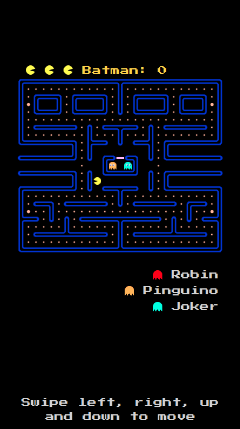
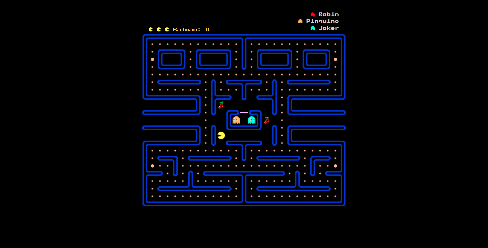

# PacmanOnline
**PacmanOnline** is a multiplayer game inspired by the video game of the same name.

Randomly a player is chosen to become PacMan. The other players will be Ghosts and will compete against PacMan

The player who plays **Pac-Man** must eat all the numerous dots scattered neatly inside the maze and, in doing so, must avoid being touched by the other players (who play **Ghosts**), in order not to lose one of the 3 lives. To help PacMan, there are four special "power pills", which turn the situation around by making the ghosts vulnerable, which turn blue for exactly 7 seconds; The PacMan player to earn points can in this phase go hunting for ghosts, to eat them.

After being eaten, they return to base (the rectangle in the center of the screen), to regenerate and attack Pac-Man again.
 
The game ends when PacMan:
 * collects all balls (both normal and special);
 * loses his 3 lives;
 * leaves the party.
 
In the first case the game is won by PacMan, in the other two cases by the Ghosts.

### Requirements
Before continuing, you need to install **Node.js**, which you can download from the [official site](https://nodejs.org/).

## How to run the project
The first step is to clone the project.
```
$ git clone https://github.com/paologiua/pacman_online.git
```
Then move to the pacman_online folder
```
$ cd pacman_online
```
and from here start the server
```
$ node server.js
```

The server will be listening on port 5000.
Then you can view the client from a browser installed on the same host as the server, by going to the **localhost:5000** address,
or from a browser on a host on the same local network as the server.

In this case it is necessary to obtain the IP address of the server.
On linux you can use  
```
$ hostname -I | cut -d' ' -f1
```
which will show an ip like 192.168.x.x.

You can view the client from a browser installed on a second host by going to **192.168.x.x: 5000**.
## Front-end
For the front-end **JavaScript**, **CSS** and **HTML** were used. Also Bootstrap was useful for implementing the column system, NES.css for some retro-game style elements and JQuery for manipulating the DOM.
#### Responsive
The interface has been designed to work on any resolution. Pacman_online can be played on both computers and mobile devices, such as smartphones and tablets.
#### Smartphone:
 
#### Desktop:
 
## Back-end
The back-end is based on **Node.js**.

Communication between client and server uses **Socket.IO**, a Javascript library for real-time web applications. It includes realtime two-way communication between web clients and servers. It consists of two parts: a client-side library that runs on the browser and a server-side library for *Node.js*.

## How to start a new game and play with friends
You can create a new game by pressing the New Game button. A code will be shown, with which other players can access the game, by writing it in the Join Game section.

***Good game!***

## Info
- ***You can find the Italian version of the README.md [here](./README-IT.md).***
- ***This work is the result of a university project carried out for the "Web Programming, Design & Usability" course of the University of Catania.***
